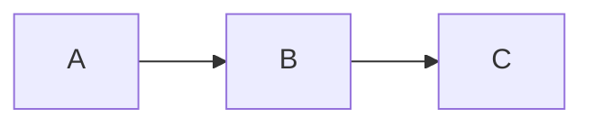

# diple — Mermaid Behavior

diple renders fenced ```` ```mermaid ```` blocks. Because a complete Mermaid
implementation is explicitly out of scope, diple supports a
defined subset natively and delegates everything else — with a deterministic
fallback chain that can never break the surrounding document.

## Backend selection

With `mermaid.backend = "auto"` (the default), diple follows this matrix for
each diagram:

| Condition | Result |
|---|---|
| the built-in renderer supports the diagram | native terminal rendering |
| not natively supported, `mmdc` available, image protocol supported | `mmdc` → PNG → terminal image |
| not natively supported, `mmdc` available, no image protocol | Mermaid source, with an external-open action |
| `mmdc` unavailable | Mermaid source |
| the render process fails | Mermaid source plus a non-fatal warning |

Overrides:

- `--mermaid terminal` — only the built-in renderer; anything else shows source
- `--mermaid mmdc` — always use the Mermaid CLI; source fallback if it fails
- `--mermaid source` — never render, always show the source
- `--mermaid-images never|always` — force the image column of the matrix off or on

Check what your terminal offers with `diple --print-capabilities`.

**No Mermaid failure can crash diple or prevent the rest of the document from
being read.** A failed diagram renders as
`[Mermaid diagram could not be rendered]` plus the source, and the reason
appears once in the status line.

Press `s` on a diagram to toggle between the rendered form and its source.

## Natively supported subset

Only **flowcharts** render natively:



```text
┌───┐     ┌───┐     ┌───┐
│ A │ ──▶ │ B │ ──▶ │ C │
└───┘     └───┘     └───┘
```

### Header

`graph` or `flowchart`, with orientation `LR`, `RL`, `TD`, `TB` or `BT`.
A missing or unrecognized orientation defaults to `TD`.

### Node shapes

| Syntax | Shape |
|---|---|
| `A` | plain node, id used as the label |
| `A[label]` | rectangle |
| `A(label)` | rounded |
| `A([label])` | stadium |
| `A{label}` | diamond |
| `A((label))` | circle |
| `A{{label}}` | hexagon |
| `A[[label]]` | subroutine |
| `A[(label)]` | cylinder |

Unknown shapes degrade to a rectangle. Labels may be quoted to contain commas
and brackets: `A["a, b"]`, with `\"` and `\\` escapes. A node redefined later
takes the newer label and shape.

Node ids may contain letters, digits, `_` and `.` — but **not** `-`, which
would make `-->` ambiguous.

### Edges

| Syntax | Meaning |
|---|---|
| `-->` `--->` | solid arrow |
| `---` `----` | solid line, no arrow |
| `-.->` `-.-` `-..->` | dotted |
| `==>` `===` | thick |
| `~~~` | invisible |
| `<--` | reversed arrow |
| `<-->` | double arrow |

Edge labels: `A -->|text| B` and `A -- text --> B` (also `-. text .->` and
`== text ==>`).

Chains and multi-endpoint edges: `A --> B --> C`, and `A & B --> C & D`
(expanded to the full product of endpoints).

### Subgraphs

`subgraph Title ... end` is parsed and may be nested. **The grouping box is not
drawn** in the terminal renderer — the nodes are laid out normally and the
diagram carries the note that grouping is not shown. Use `mmdc` with an
image-capable terminal if the grouping matters visually.

### Ignored gracefully

`%%` comments, `%%{init: ...}%%` directives, and `click`, `style`, `classDef`,
`linkStyle`, `class`, `direction`, `accTitle` lines. Statements may be
separated by newlines or `;`.

### Not supported natively

Sequence, class, state, ER, Gantt, pie and journey diagrams. These go straight
to the `mmdc` or source branch of the matrix.

## Native rendering details

Nodes are assigned to layers by longest path (cycles are broken deterministically
and drawn as feedback edges), ordered within a layer by a barycentre heuristic
with deterministic tie-breaking — the same input always produces byte-identical
output. Edges are routed orthogonally around box areas, and edges spanning more
than one layer get their own detour lane.

Diagrams never exceed the terminal width: labels are progressively shortened,
and if the diagram still does not fit, diple falls back to the source rather
than emitting a corrupted picture.

Where the terminal cannot draw Unicode box characters (a non-UTF-8 locale), an
ASCII fallback (`+--+`, `|`, `-`, `>`, `v`) is used automatically.

## Using the Mermaid CLI

Install `mmdc` (`npm install -g @mermaid-js/mermaid-cli`), or point diple at a
specific binary:

```toml
[mermaid]
mmdc_command = "/usr/local/bin/mmdc"
```

diple invokes it with a hard 10-second timeout and caches the resulting PNG
under `~/.cache/diple/mermaid/`, keyed by a hash of the diagram source and the
requested width — so scrolling and resizing never re-invoke it.

Images are displayed through the Kitty graphics protocol, iTerm2 inline images
or sixel, depending on what the terminal supports. Inside tmux, image protocols
are **disabled by default** because they require passthrough; enable it with:

```tmux
set -g allow-passthrough on
```

## Troubleshooting

| Symptom | Cause and fix |
|---|---|
| Diagram shows as source in a capable terminal | run `diple --print-capabilities`; check the `images` row and its stated reason |
| Nothing renders as an image inside tmux | enable `allow-passthrough` (above) |
| `[Mermaid diagram could not be rendered]` | the status line names the reason; press `s` to read the source |
| The diagram is a flowchart but still not native | check for unsupported syntax such as ids containing `-` |
| `mmdc` is installed but unused | `backend` or `images` may be pinned in your config, or no image protocol is available |
