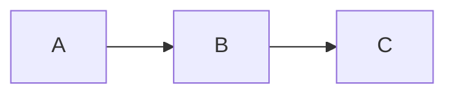
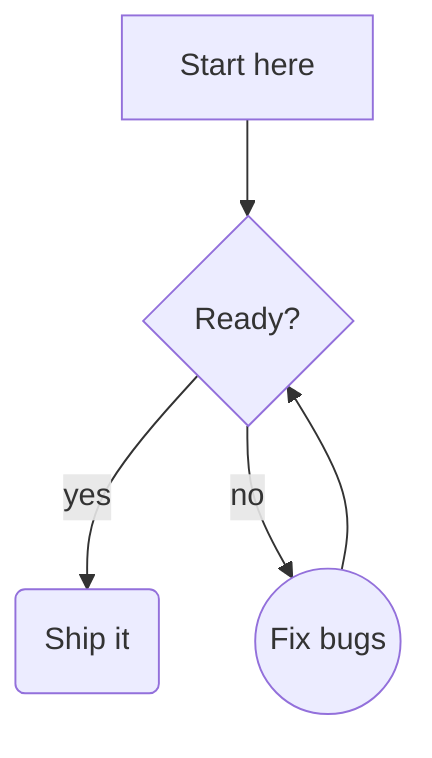
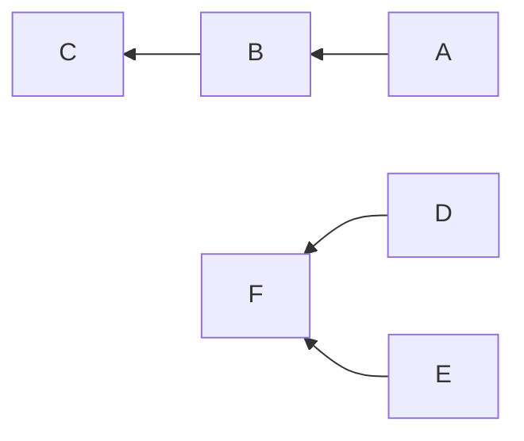
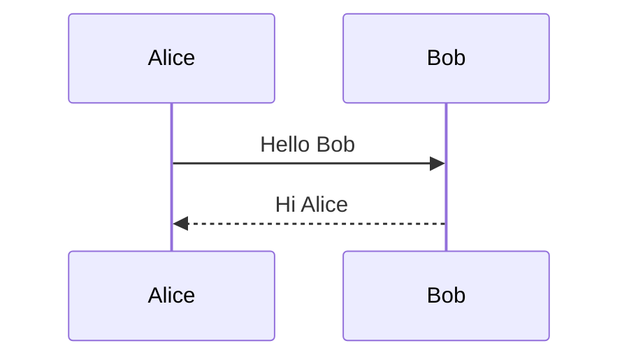

P# Mermaid Diagrams

## Simple flow



## Top-down with labels



## Chains and fan-in



## Unsupported diagram type



Regular paragraph between diagrams.

## Not mermaid

```text
graph LR
    this is just a text block
```
